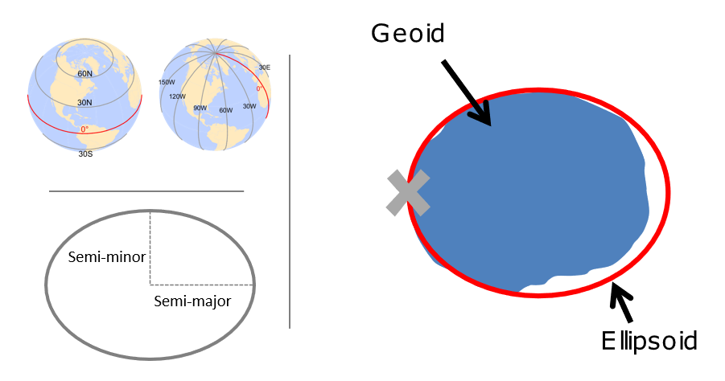

========================================================
---
RCC 2021 workshop series
Introduction to Spatial Analysis with R

Instructor: Parmanand Sinha

---
Introduction
========================================================
R is an open-source language for statistical computing. A good way to think about R is as a core package, to which a p_load, consisting of additional packages, can be attached to increase its functionality. R can be downloaded for free at:

https://cran.rstudio.com/

R comes with a built-in console (a user graphical interface), but better alternatives to the basic interface exist, including RStudio, an Integrated Development Environment, or IDE for short. RStudio can also be downloaded for free, by visiting the website:

https://www.rstudio.com/products/rstudio/download/

Basic Packages
========================================================

For reading and writing vector and raster data in R, the three primary packages you will use are:

sf or rgdal for vector formats such as ESRI Shapefiles, GeoJSON, and GPX - both packages use OGR, which is a p_load under the GDAL source tree,under the hood
raster for raster formats such as GeoTIFF or ESRI or ASCII grid using GDAL under the hood
We can quickly discover supported I/O vector formats either via sf or rgdal

Packages Management
========================================================
```{r}
# load the raster, sp, and rgdal packages
install.packages("pacman")
library("pacman")
```

Coordinate system
========================================================

A CRS is made up of several components:

Coordinate system: The x,y grid that defines where your data lies in space
Horizontal and vertical units: The units describing grid along the x,y and possibly z axes
Datum: The modeled version of the shape of the earth
Projection details: If projected, the mathematical equation used to flatten objects from round surface (earth) to flat surface (paper or screen)

```{r}
setwd("~/GitHub/SpatialAnalysis_R")

```


Dataframe
========================================================

```{r}
#The function 'head' will display the first few rows of the dataframe, snow_deaths 
snow_deaths<-load("./data/snow_deaths.RData")
snow_pumps<-load("./data/snow_pumps.RData")

head(snow_deaths)

head(snow_pumps)
```

Tidyverse and plotting
========================================================
'Tidyverse' is a collection of R packages designed for data science used in everyday data analyses  

```{r}

p_load(tidyverse)
```

Tidyverse and plotting
========================================================

The function 'ggplot' is used for data visualization - it creates a graph. The function 'geom_point' tells R you want to create a plot of points. 'data = snow_deaths' tells R you want to use the 'snow_deaths' dataframe. 'aes' stands for aesthetics of your graph where 'x = long' sets the x axis to 'long', where 'y = lat' sets the y axis to 'lat', where 'color = blue' colours the points blue and 'shape = 16' assigns the shape of the points - in this case, '16' are circles and '17' are triangles  

```{r}
ggplot() +
  geom_point(data = snow_deaths, aes(x = long, y = lat), color = "blue", shape = 16) +
  geom_point(data = snow_pumps, aes(x = long, y = lat), color = "black", shape = 17)
```


Vector data with sf
========================================================
sf is an implementation of Simple features, an open standard developed and endorsed by the Open Geospatial Consortium (OGC).

The big difference between sf and sp is that sf uses S3 classes rather than S4 as sp does. Simple features are simple data.frame objects that have a geometry list-column. The simple feature model will be familiar to those who use PostGIS, MySQL Spatial Extensions, Oracle Spatial, the OGR component of the GDAL p_load, GeoJSON and GeoPandas in Python. 

```{r}
knitr::include_graphics("./figure/sf_deps.png")
```

```{r}
p_load(sf)
methods(class = 'sf')

```

 Geoprocessing
======================================================== 
```{r}
p_load(sf)
p_load(tigris)
p_load(tmap)
```

```{r}
counties <- counties("Texas", cb = TRUE)
counties<-st_as_sf(counties)
counties$area <- as.numeric(st_area(counties))
glimpse(counties)
```

```{r}
tm_shape(counties) +
  tm_polygons("area", 
              style="quantile", 
              title="Texas Counties Area")
              
p_load(mapview)
mapview(tex_cap, col="red", col.regions = "red") + mapview(counties, alpha.regions = .1)              
```              


 Typical topological operations
 
 
 Spatial Subsetting
======================================================== 
```{r}
 counties[NAME="Houston",]
  
  
```

 

 Dissolve
======================================================== 
```{r}
counties %>% 
  group_by(STATEFP) %>%
  summarise(area = sum(area))
 
```
 
 Visualizing Spatial Data
========================================================

```{r}
# 'Leaflet' is a package used for visualizing data on a map in R. 'Magrittr' is a package used for creating pipe operators 
#install.packages('leaflet') # Run only if you have not yet installed `leaflet`!
#install.packages('magrittr') # Run only if you have not yet installed `magrittr`!
p_load(leaflet)
p_load(magrittr)

# Here, we create a `leaflet` object and assign it to the variable, 'm'. The 'setView' function sets the view of the map where 'lng = -0.136' sets the longitutde, 'lat = 51.513' sets the latitude and the map zoom is set to 16. The '%>%' is a pipe operator that passes the output from the left hand side of the operator to the first argument of the right hand side of the operator. In this case we are telling `R` that we want to center the map on the set longitude and latitude, with a zoom level of 16, which corresponds roughly to a neighborhood 

m <- leaflet(data = snow_deaths) %>% 
  setView(lng = -0.136, lat = 51.513, zoom = 16)

```

Leaflet
========================================================
```{r}
#The map is empty! This is because we have not yet added any geographical information to plot. We can begin by adding a basemap as follows:

# We are adding a basemap or background map of the study location by means of the `addTiles` function to the 'm' variable 
m <- m %>% addTiles()
m
```

Visualization
========================================================

The map now shows the neighborhood in Soho where the cholera outbreak happened. Now, at long last, we can add the cases of cholera deaths to the map. For this, we indicate the coordinates (preceded by ~), and set an option for clustering by means of the clusterOptions in the following fashion:

We are adding the cholera deaths to the map using 'group = Deaths'. The '~' symbol tells R to use the same longitude and latitude values used in the previous block of code and the 'clusterOptions = markerClusterOptions()' clusters a large number of markers on the map - in this case it is clusturing number of deaths into icons with numbers  

```{r}
m <- m %>% addMarkers(~long, ~lat, clusterOptions = markerClusterOptions(), group = "Deaths")
m
```
The map now displays the locations of cholera deaths on the map. If you zoom in, the clusters will rearrange accordingly. Try it! The other information that we have available is the location of the water pumps, which we can add to the map above (notice that the Broad Street Pump is already shown in the basemap!):

```{r}
m %>% addMarkers(data = snow_pumps, ~long, ~lat, group = "Pumps")
```

An alternative and quicker way to run the same bit of code is by means of pipe operators (%>%). These operators make writing code a lot faster, easier to read, and more intuitive! Recall that a pipe operator will take the output of the preceding function, and pass it on as the first argument of the next:

```{r}
m_test <- leaflet () %>% 
  setView(lng = -0.136, lat = 51.513, zoom = 16) %>% 
  addTiles() %>% 
  addMarkers(data = snow_deaths, ~long, ~lat, clusterOptions = markerClusterOptions(), group = "Deaths") %>% 
  addMarkers(data = snow_pumps, ~long, ~lat, group = "Pumps")
m_test

p_load(leaflet.extras)
m2 <- leaflet(data = snow_deaths) %>% 
  setView(lng = -0.136, lat = 51.513, zoom = 16) %>% 
  addTiles()
```  
  
```{r}
# The 'addHeatmap' function is making a heat map. We specify the coordinates, same as the block of code above. The 'intensity' function sets a numeric value, the 'blur' specifies the amount of blur to apply and the 'radius' function sets the radius of each point on the heatmap 
m2 %>% addHeatmap(lng = ~long, lat = ~lat, intensity = ~Count,
             blur = 40, max = 1, radius = 25)
             
#Lastly, you can also add markers for the pumps as follows:

m2 %>% addHeatmap(lng = ~long, lat = ~lat, intensity = ~Count,
                  blur = 40, max = 1, radius = 25) %>%
  addMarkers(data = snow_pumps, ~long, ~lat, group = "Pumps")             
```


```{r}
#And everything together:


m2_test <- leaflet(data = snow_deaths) %>%
  setView(lng = -0.136, lat = 51.513, zoom = 16) %>% 
  addTiles() %>% 
  addHeatmap(lng = ~long, lat = ~lat, intensity = ~Count,blur = 40, max = 1, radius = 25) %>% 
  addMarkers(data = snow_deaths, ~long, ~lat, clusterOptions = markerClusterOptions(), group = "Deaths") %>% 
  addMarkers(data = snow_pumps, ~long, ~lat, group = "Pumps")
m2_test
```

For more information on the functionality of leaflet, please check Leaflet for R


Raster Data


In general, R requires dataset to be loaded into memory. A notable feature of the raster package is that it can work with   raster datasets that are stored on disk and are too large to be loaded into memory (RAM). 
 


```{r}
install.packages("rgdal")
```


```{r}


p_load(rgdal)
p_load(raster)
p_load(sp)
p_load(sf)
p_load(fasterize)
```
download gridded population data

```{r}
dir.create("rasterdata")
setwd(file.path(getwd(),"rasterdata"))
getwd()
rf1<-"NPL_ppp_2020_v2.tif"
rf2<-"NPL_pph_2020_v2.tif"

if(!file.exists(rf1)){
file.path1 <-"ftp://ftp.worldpop.org.uk/GIS/Population/Individual_countries/NPL/Nepal_100m_Population/NPL_ppp_2020_v2.tif"
    download.file(file.path1, rf1,  mode = "wb")
        }
if(!file.exists(rf2)){
file.path2 <-"ftp://ftp.worldpop.org.uk/GIS/Population/Individual_countries/NPL/Nepal_100m_Population/NPL_pph_2020_v2.tif"
    download.file(file.path2, rf2,  mode = "wb")
        }
```


```{r}
setwd(file.path(getwd(),"rasterdata"))
rf1<-"NPL_ppp_2020_v2.tif"
rf2<-"NPL_pph_2020_v2.tif"
file.exists(rf1)
file.exists(rf2)
```


TRUE


TRUE


```{r}
## ----load-raster---------------------------------------------------------
# load raster in an R object called PD (population density)

```


```{r}
PD<-raster(rf1)
# look at the raster attributes. 
PD

# calculate and save the min and max values of the raster to the raster object
PD <- setMinMax(PD)

# view raster attributes
PD

#Get min and max cell values from raster
#NOTE: this code may fail if the raster is too large
cellStats(PD, min)
cellStats(PD, max)
```

view coordinate reference system

```{r}
## ----crs-----------------------------------------------------------------

PD@crs
```

view raster extent
```{r}
## ----view-extent---------------------------------------------------------

PD@extent

```


```{r}
## ----crop raster-------------------------------------------------
## 
plot(PD)
## #Define the extent of the crop by clicking on the plot
cropbox1 <- drawExtent()
## #crop the raster, then plot the new cropped raster
PDcrop1 <- crop(PD, cropbox1)
## 
## #plot the cropped extent
plot(PDcrop1)
## 
```


```{r}
## ----crop Kathmandu area-----------------------------------------

#download Nepal shapefile
nepal_shp<-getData('GADM', country="NEPAL", level=3)
plot(nepal_shp)
#select Kathmandu region
Kathmandu_shp<-nepal_shp[nepal_shp$NAME_3 %in% c("Kathmandu", "Bhaktapur", "Lalitpur"),]

plot(Kathmandu_shp)
invisible(text(coordinates(Kathmandu_shp), labels=as.character(Kathmandu_shp$NAME_3)))

#Crop Kathmandu region
PD_kath <- crop(PD, Kathmandu_shp)
```
